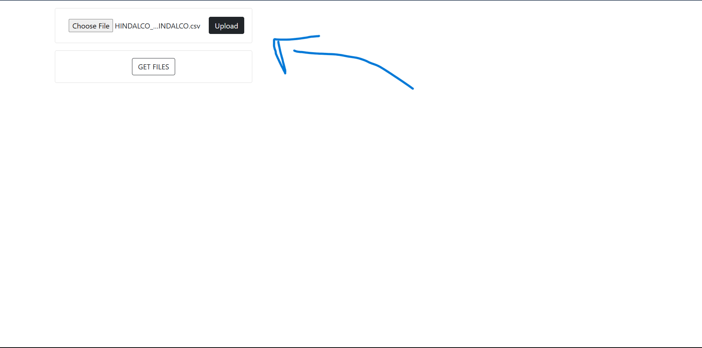
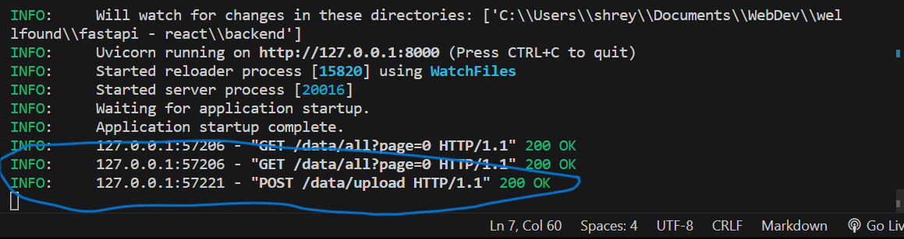
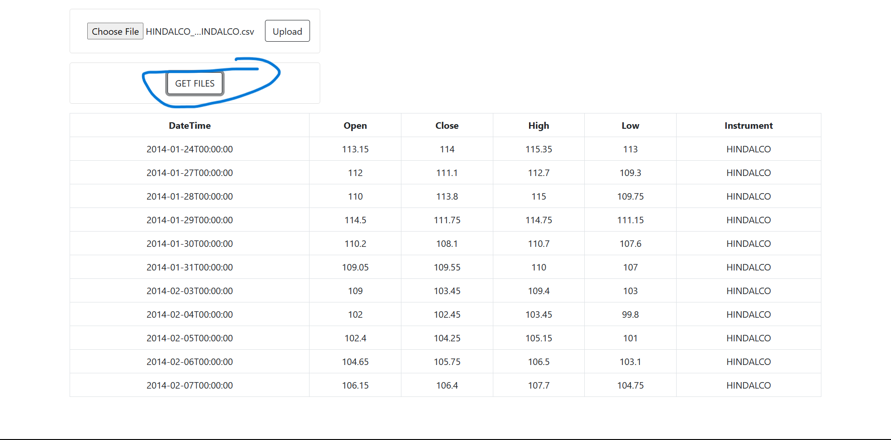

Requirements:

1. Rust: https://rustup.rs/

2. Now run this command: ``` pip install -r requirements.txt```

3. cd into the frontend/ticker folder and run ``` npm i ```

4. cd into the backend folder using another terminal and start the app with ``` uvicorn main:app --reload```

# Screenshots


